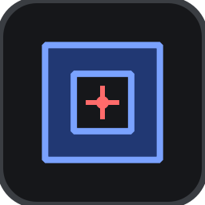
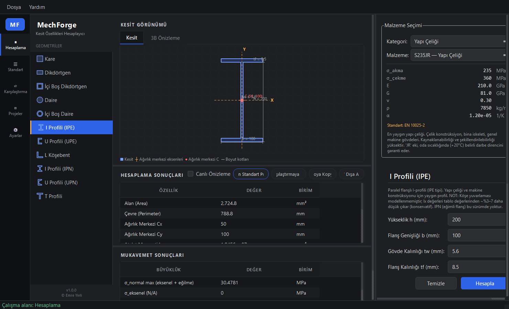
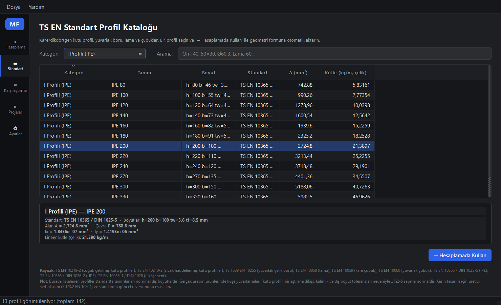
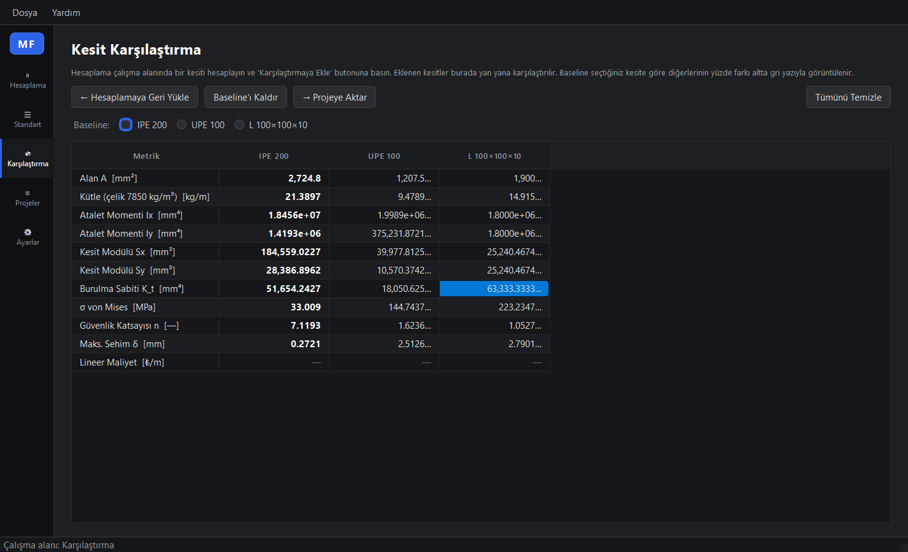
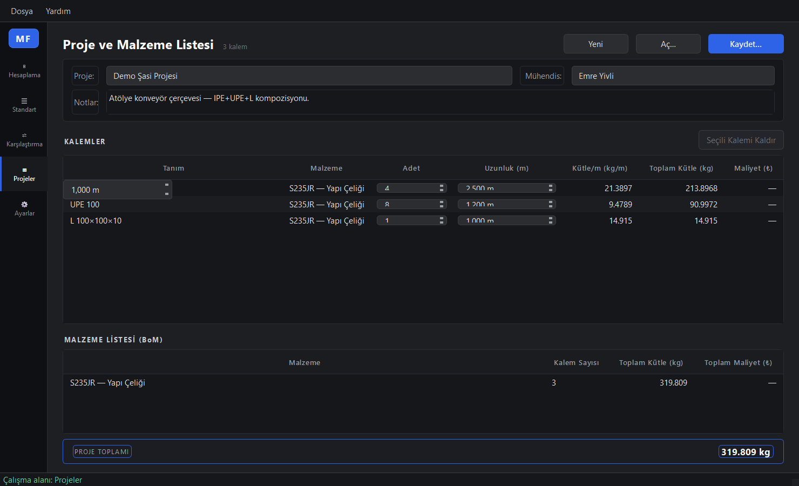
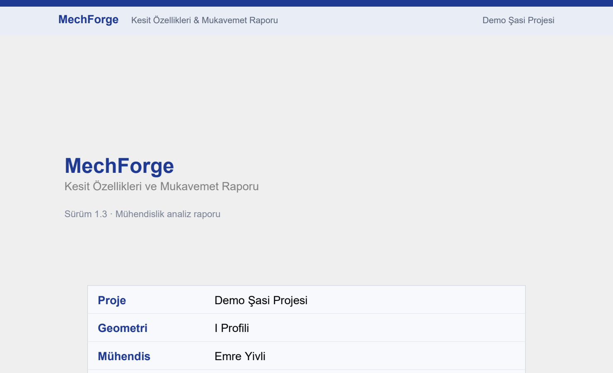

# MechForge

### Kesit Hesabı · Mukavemet Analizi · Tek Uygulama
*Cross-section properties & strength analysis for mechanical engineers*

Makine ve imalat mühendisleri için parametrik kesit özellikleri, gerilme zarfı, güvenlik katsayısı, 3D önizleme ve PDF rapor — **tamamen yerel, bulut yok, telemetri yok.**

**[⬇ Windows Installer İndir](https://github.com/emreyivli/Mech-Forge/releases/latest)**

---

| **11** | **142** | **15** | **192** |
|:---:|:---:|:---:|:---:|
| Geometri | TS EN Profil | Malzeme | Doğrulama Testi |

---

## Neden MechForge? — Eksik olan dördüncü seçenek

Mühendisler bir yapısal eleman boyutlandırmak istediğinde genellikle üç araca başvurur — ve her biri bir şekilde yetersiz kalır:

- 📊 **Excel tablosu** — yıllardır yamanan, denetlenemeyen, kopyala-yapıştır hatalarıyla dolu.
- 🖥️ **Ağır FEA suiti** (SolidWorks, ANSYS) — dakikalarca açılır, lisans gerektirir, basit bir kesit kontrolü için fazla güçlü.
- 🌐 **Online hesaplayıcı** — hangi formülü kullandığı belirsiz, denetim izi yok, verileriniz bilinmeyen yerlere gider.

**MechForge eksik olan dördüncü seçenektir.** Küçük, odaklı, yerel bir masaüstü uygulaması: geometri + mukavemet hesabını saniyede yapar, kullandığı her formülü gösterir (Yardım → Formül Referansı), internetsiz çalışır ve müşteriye/denetçiye sunabileceğin profesyonel bir PDF rapor üretir.

---

## ✨ Yetenekler

| Alan | Kapsam |
|---|---|
| **11 Geometri** | Kare · Dikdörtgen · İçi Boş Dikdörtgen · Daire · İçi Boş Daire · IPE · UPE · L Köşebent · IPN · UPN · T Profili |
| **Kesit Özellikleri** | Alan · Çevre · Ağırlık Merkezi (Cx, Cy) · Atalet Momenti (Ix, Iy) · Polar (Jz) · Kesit Modülü (Sx, Sy) · Saint-Venant K_t · Ana eksenler (L için Iu, Iv) |
| **Mukavemet Analizi** | σ_normal · τ_kesme · τ_burulma · von Mises · güvenlik katsayısı (4 bölgeli renk skalası) · sehim · burulma açısı · lineer kütle & maliyet |
| **15 Malzeme** | S235JR / S275JR / S355JR · C20 / C40 / C50 · 42CrMo4 · AISI 304 / 316L · GG-25 · Al 6061-T6 / 5052-H32 / 7075-T6 · CuZn37 · PA6 — EN standart referanslı tam özellik seti |
| **142 Standart Profil** | TS EN 10219 (SHS/RHS) · TS 1689 (CHS) · TS EN 10365 (IPE/UPE) · TS EN 10056-1 (L) · TS EN 10024 (IPN) · DIN 1026-1 (UPN) · TS EN 10055 (T) ve daha fazlası |
| **3D Önizleme** | Interaktif OpenGL 4.1 Core · Phong shading · 4× MSAA · orbital kamera · tel kafes toggle · üçgen sayacı |
| **Dışa Aktarım** | PDF Rapor (6 bölüm) · STL (FEA / 3D baskı) · CSV · TXT · Pano kopyası |
| **Proje I/O** | `.mfproj` (tek kesit) · `.mfproj-multi` (çoklu kesit + BoM + maliyet özeti) |
| **Araçlar** | Yan yana kesit karşılaştırma · Yakın standart profil önerisi · Canlı önizleme · Özelleştirilebilir güvenlik eşikleri · Malzeme fiyatları (₺/kg) |
| **Dil** | Türkçe & İngilizce arayüz |

---

## 📸 Ekran Görüntüleri

### Hesaplama Çalışma Alanı
Geometri girişi · ağırlık merkezi eksenleri ve boyut etiketleriyle 2D kesit çizimi · canlı geometrik sonuçlar · renk kodlu güvenlik katsayısı ile mukavemet analizi.

### Standart Profil Kataloğu
142 TS EN profili · kategori filtresi + serbest metin araması · alan, atalet momentleri ve lineer kütle gösteren canlı detay kartı · tek tıkla "Hesaplamada Kullan".

### Kesit Karşılaştırma
Altı kesit yan yana · yüzde deltalarla baseline seçici · alandan lineer maliyete kadar tüm metrikler · baseline'ı Hesaplamaya geri yükle veya tüm seti projeye aktar.

### Proje & Malzeme Listesi (BoM)
Kalem başına adet × uzunluk · malzemeye göre gruplanmış BoM · toplam kütle ve maliyet kartı · `.mfproj-multi` kaydet/yükle.

### PDF Rapor
Her sayfada markalı başlık · sürüm rozetli kapak · σ_akma + kullanım oranı (%) satırları (renk kodlu) · "Doğrulama ve Sınırlamalar" eki.

---

## ⬇ İndir / Download

### **[» MechForge-1.3.0-Setup.exe «](https://github.com/emreyivli/Mech-Forge/releases/latest)**

1. Yukarıdaki linkten `MechForge-1.3.0-Setup.exe` dosyasını indirin.
2. Kurulum sihirbazını takip edin.
3. MechForge'u Başlat Menüsü veya masaüstü kısayolundan başlatın — hazırsınız!

**Sistem gereksinimleri:** Windows 10 / 11 · 64-bit · OpenGL 4.1 destekli ekran kartı (2011 sonrası herhangi bir donanım).

---

## 🛡️ Kurulum & Güvenlik

> **Windows "Bilgisayarınızı korudu" ekranı çıkarsa panik yapmayın — bu normaldir.**

MechForge yeni yayınlanmış, bağımsız bir uygulamadır ve henüz pahalı bir kod imzalama sertifikası ile imzalanmamıştır. Bu yüzden Windows SmartScreen, dosyayı tanımadığı için ilk açılışta mavi bir uyarı gösterebilir. Bu, **virüs tespiti değil, "tanımıyorum" uyarısıdır.** Kurmak için:

1. Mavi ekranda **"Ek bilgi" / "More info"** yazısına tıklayın.
2. Beliren **"Yine de çalıştır" / "Run anyway"** butonuna basın.

### Bağımsız doğrulama

Şüpheniz olmasın diye installer'ı [VirusTotal](https://www.virustotal.com/gui/file/c2b0552b65e9ad88f5d85ac9968a3a2aa6fd5c85f8ccdfe4c474ea162878f924) üzerinde **70 bağımsız antivirüs motoruyla** taradık:

> **69 / 70 motor "temiz" dedi** — Microsoft Defender, Kaspersky, BitDefender, Avast, McAfee, Symantec, Sophos, TrendMicro, CrowdStrike, Google ve diğerleri dahil. Tek istisna olan ESET, gerçek bir tehdit değil, yalnızca uygulamanın derlendiği **Nuitka paketleyicisine** ait jenerik bir sezgisel (heuristic) işaretlemedir — bu, Nuitka/Python ile derlenmiş temiz uygulamalarda sık görülen, bilinen bir yanlış-pozitiftir.

🔒 MechForge **tamamen çevrimdışı** çalışır: internet bağlantısı kullanmaz, hiçbir veri toplamaz, hiçbir telemetri göndermez. Tek kalıcı dosyası tercihlerinizi tutan `~/.mechforge/settings.json` dosyasıdır.

---

## 🔬 Mühendislik Güvencesi

Bu, çoğu hesaplayıcının atladığı kısım. MechForge **iki katmanlı, denetim kalitesinde kanıt** ile gelir.

**1 · Formül Kaynağı** — Her formül, onu uygulayan fonksiyonun docstring'inde kaynak referansıyla verilmiştir ve uygulama içinden **Yardım → Formül Referansı** ile okunabilir. Başlıca kaynaklar: *Timoshenko (Theory of Elasticity)*, *Roark's Formulas for Stress and Strain*, *Beer & Johnston (Mechanics of Materials)*, *Shigley's Mechanical Engineering Design*, *TS EN 1993-1-1 (Eurocode 3)*.

**2 · Otomatik Doğrulama (192 / 192 yeşil)** — Her sürüm öncesi bir doğrulama paketi çalışır:
- **9 profil ailesi** üretici katalog değerleriyle karşılaştırılır (ör. IPE 200 katalog A = 2848 mm², MechForge = 2725 mm² → %4.3 konservatif sınır içinde).
- **15 malzeme** iç tutarlılık kontrolünden geçer (σ_y < σ_u, izotropik G ≈ E/(2(1+ν)) vb.).
- **142 profil** dispatch bütünlüğü doğrulanır.

**3 · Konservatif Yön** — Tüm yaklaşıklamalar **güvenli tarafta** tutulur (daha düşük Ix → daha yüksek gerilme → daha düşük güvenlik katsayısı). Konservatif olmayan iki vaka (UPE Cx, L standart Ix) uygulama içinde açıkça uyarılır.

> ⚠️ **Sorumluluk reddi:** MechForge bir mühendislik yardımcı aracıdır. Tüm kritik tasarımlar yetkili bir mühendis tarafından doğrulanmalıdır. Sonuçların kullanımından doğacak sorumluluk kullanıcıya aittir.

---

## 📋 Sürüm Notları

Güncel değişiklikler ve sürüm geçmişi için **[Releases](https://github.com/emreyivli/Mech-Forge/releases)** sayfasına bakın. Uygulama, yeni bir sürüm yayınlandığında menü çubuğunda otomatik (anonim, telemetrisiz) bir güncelleme rozeti gösterir.

---

## 📄 Lisans

MechForge tescilli (proprietary) bir yazılımdır. Telif hakkı © 2026 **Emre Yivli** — Tüm hakları saklıdır.

## 👤 Geliştirici

Tasarım ve geliştirme: **Emre Yivli** — İmalat Mühendisi
🌐 [emreyivli.com](https://emreyivli.com) · ✉️ [emre@emreyivli.com](mailto:emre@emreyivli.com)
